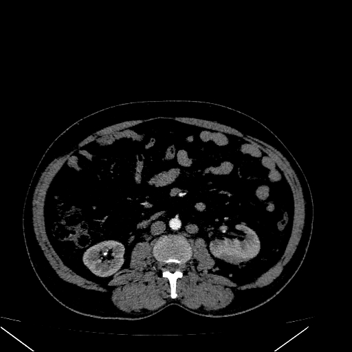

# 🧪 Kidney Disease Classifier - ViT Model  

This is a deep learning-based **Kidney Disease Classification Web App** that uses **Vision Transformers (ViT)** to classify kidney CT scans into four categories:  
✅ **Cyst**  
✅ **Normal**  
✅ **Stone**  
✅ **Tumor**  

## 📌 Features  
🔹 Upload a CT scan image for prediction  
🔹 Uses **ViT (Vision Transformer) with Transfer Learning**  
🔹 Flask-based backend for handling image processing and model inference  
🔹 Simple web interface using HTML, CSS, and JavaScript  

## 🛠️ Tech Stack  
- **Backend:** Flask, PyTorch, timm  
- **Frontend:** HTML, CSS, JavaScript  
- **Model:** Vision Transformer (`vit_large_patch16_224`)  

## 📊 Dataset  
The model was trained using the **Kidney Disease Dataset**, which consists of CT images labeled into four categories: **Cyst**, **Normal**, **Stone**, or **Tumor**  
- **Original Dataset:** [CT Kidney Dataset - Normal, Cyst, Tumor, and Stone](https://www.kaggle.com/datasets/nazmul0087/ct-kidney-dataset-normal-cyst-tumor-and-stone)  
- **My Dataset:** [Subset of CT Kidney Dataset](https://drive.google.com/drive/folders/1ukYvNvMWhC8kzYSDqhQ-K04wQUE6M5Jp?usp=drive_link)
---  

## 🚀 Running the Project on Localhost  

### 1⃣ Clone the Repository  
```bash
git clone https://github.com/LonerWarlock/ViT-Kidney-Disease-Classifier.git
cd ViT-Kidney-Disease-Classifier
```

### 2⃣ Install Dependencies  
Make sure you have **Python 3.8+** installed. Then, run:  
```bash
pip install -r requirements.txt
```

### 3⃣ Place the Trained Model  
Download the trained [ViT model](https://drive.google.com/drive/folders/1Pu6pmwZRnEceOHVdMp3OyC4OKHv3Lqzp?usp=sharing) named `model.pth` and place it in the project directory.  

### 4⃣ Start the Flask Server  
```bash
python app.py
```
By default, the app will run on **http://127.0.0.1:5000/**.  

### 5⃣ Open the Web App  
Open your browser and go to:  
```
http://127.0.0.1:5000/
```
Upload a CT scan image from the **CT Scan Images** folder, and the model will predict the category.

---  

## 🖼️ Example Prediction  
Upload a CT scan, and the model will predict the disease category.  

   

``` Prediction: Tumor ```

---  

## 📌 To-Do  
- [ ] Improve model accuracy  
- [ ] Add more kidney disease types  
- [ ] Deploy online  

## 🐟 License  
This project is licensed under the MIT License.  
